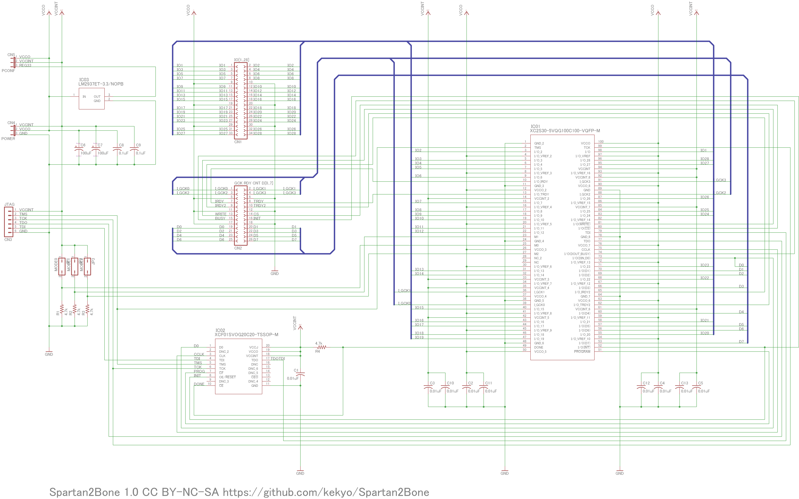
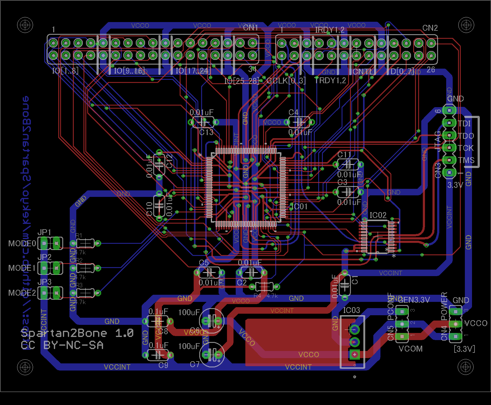
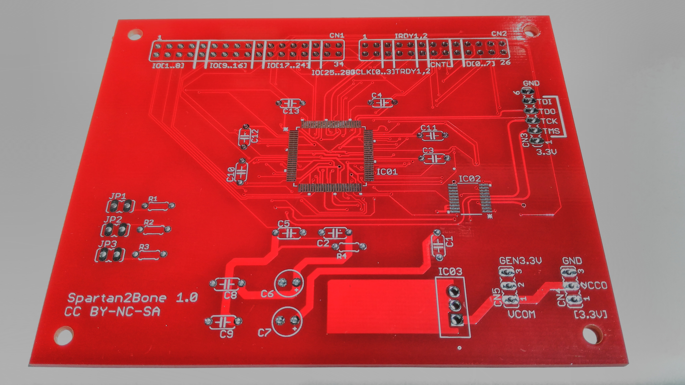
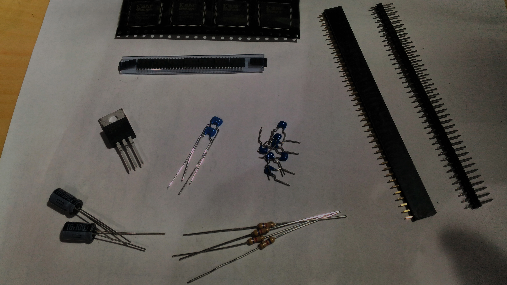
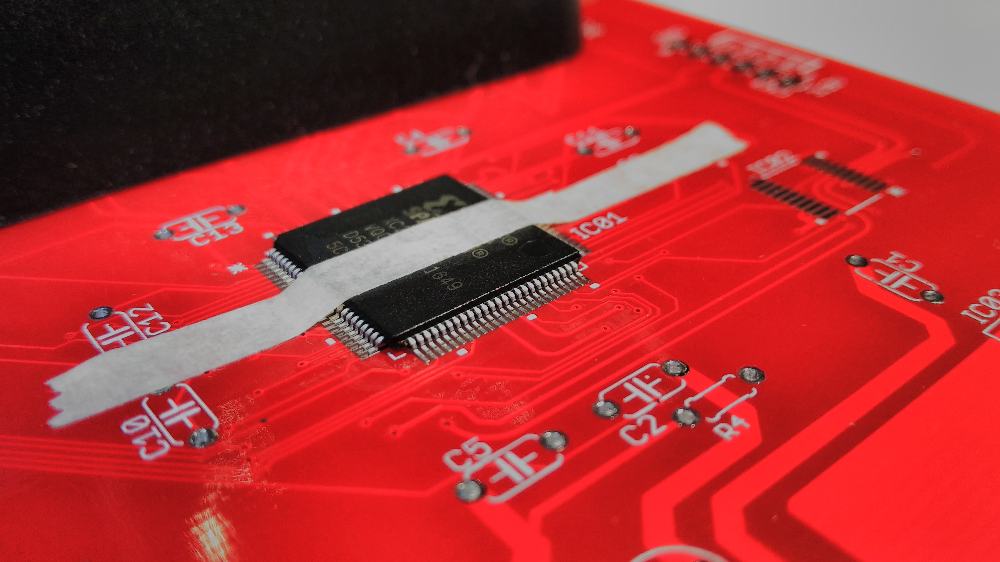
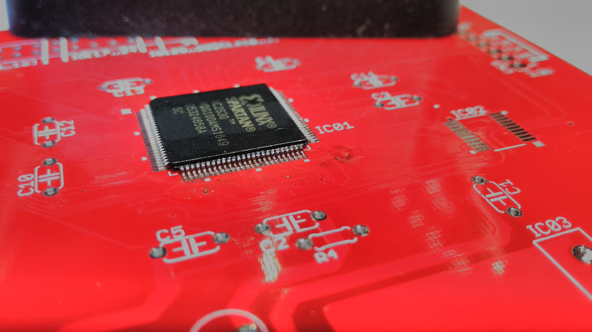
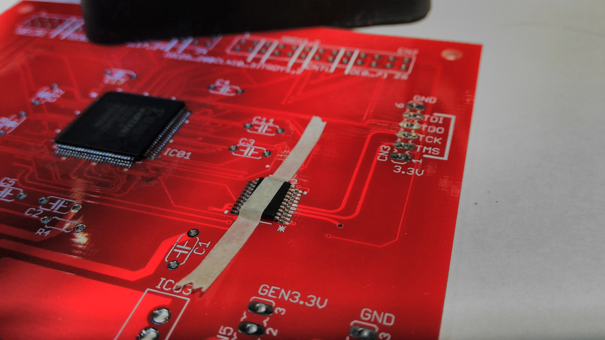
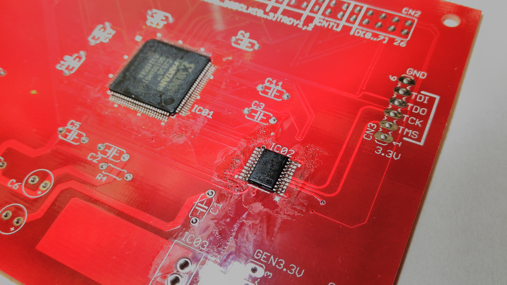
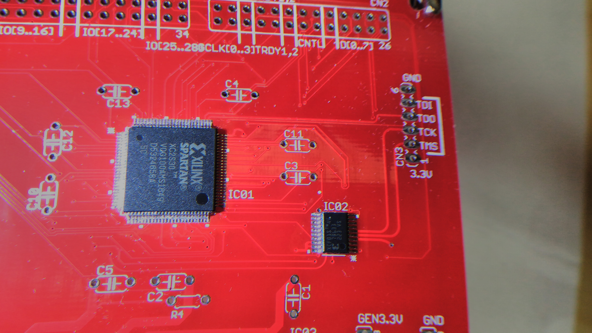
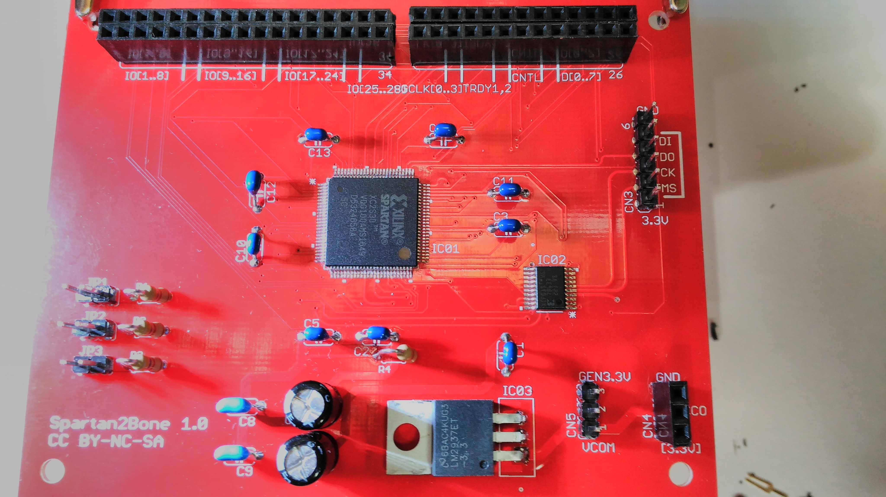

# Spartan2Bone

## What is this?

* This is prototyping board for Xilinx Spartan-II FPGA processor.
* These circuit mostly simple and easy usage, exclude any test devices.

## Features

* This board include features:
  * [Xilinx XC2S30 Spartan-II FPGA processor](https://www.xilinx.com/support/documentation/data_sheets/ds001.pdf)
  * [Xilinx XCF01S 1Mbit configuration flash ROM](https://www.xilinx.com/support/documentation/user_guides/ug161.pdf)
  * I/O header (IO[1..28], I_GCK[0..3], D[0..7], IRDY[1..2], TRDY[1..2], /WRITE, /CS, BUSY, INIT)
  * JTAG header
  * Mode jumper
  * 3.3V regulator and power configuration jumper

## Why Spartan-II now?

* Xilinx Spartan-II FPGA family already deprecated, these processors too old. But Spartan-II has "3.3V operation and 5V torelant I/Os."
* That means, easy usage for "Prototyping by breadboard or likely environments."
* We can get Spartan-II some market (ex: DigiKey). (2017 May)
* Another fit usages, we can use Xilinx XC95 CPLD series. This processors too old and NOT deprecated, but too few macro cells/registers. If you are interesting XC95, [try to my project PGA44DIP44](https://github.com/kekyo/PGA44DIP44).

TODO:

## Pre render output

## How to create Spartan2Bone

* Order and get Spartan2Bone PCB.

* Order and get required parts (TODO: parts list)

* Solder Spartan-II
  * Caution!! You must looks direction for Spartan-II! If you missed, repair too hard.

* Solder configuration flash ROM
  * Caution direction too.

* Cleaning by Flux remover.

* Solder other parts.

## Sample codes

### LedBrink

* [Sample for simple LED brink code. (Require Xilinx ISE 10.1)](LedBrink/)

### FizzBuzz

* [Sample for FizzBuzz by VerilogHDL. Output by 7seg LED and two Fizz-Buzz LEDs. (Require Xilinx ISE 10.1)](FizzBuzz/)

## LICENSE

* Schematic, artwork and documents: [Under CC BY-NC-SA 4.0](https://creativecommons.org/licenses/by-nc-sa/4.0/)
* Code: [Apache V2](https://www.apache.org/licenses/LICENSE-2.0)
